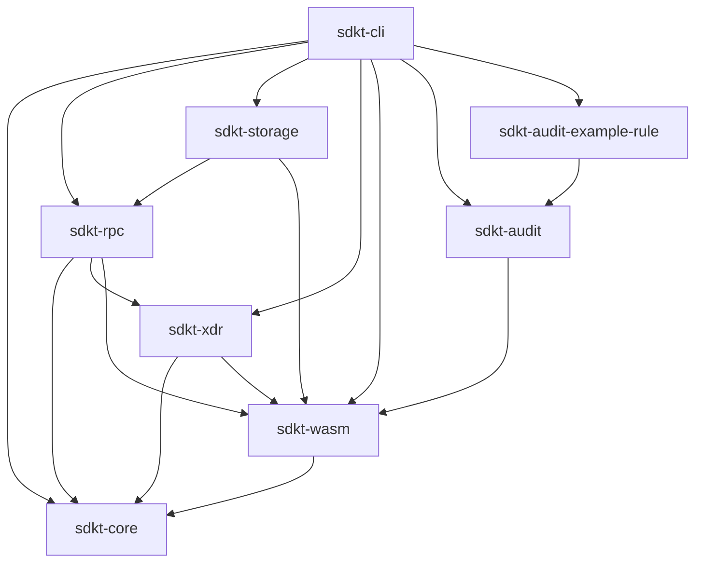

# `sdkt` Workspace Architecture

## Overview

Soroban DevKit (`sdkt`) is a modular Rust workspace providing a unified toolkit
for Stellar / Soroban development. It is split into focused crates to keep
compile times low, dependency boundaries clean, and the surface easy to extend.

The command-line binary `sdkt` is produced by the `sdkt-cli` crate. All
business logic lives in the supporting crates; the CLI only routes arguments
and formats output.

## Crate layout and dependency flow

### 1. `sdkt-core`

- **Purpose**: Global configuration and shared types.
- **Key types**: `DevKitConfig`, `NetworkConfig`, `DecodeConfig`, `StorageConfig`, `OutputFormat`, `ValidationError`.
- **Dependencies**: `serde`, `toml`.
- **Rule**: Must not depend on any other workspace crate, and must perform no networking or I/O.

### 2. `sdkt-xdr`

- **Purpose**: XDR decoding, encoding, and raw payload manipulation.
- **Key functions**: `decode()`, `encode_ledger_key()`, `extract_wasm_hash()`, `decode_event_topics()`; typed builder helpers in `builder`.
- **Dependencies**: `stellar-xdr`, `base64`, `hex`, `sdkt-core`, `sdkt-wasm`.
- **Rule**: Must not perform networking or I/O.

### 3. `sdkt-wasm`

- **Purpose**: Contract WASM inspection and offline analysis.
- **Key types**: `ContractSpec` parser, `WasmModule` inspector, `SpecDiff`, `UpgradeVerdict` (`upgrade_safety` / `upgrade_safety_wasm`).
- **Dependencies**: `sdkt-core`.
- **Rule**: Offline only (parses bytes); no network.

### 4. `sdkt-rpc`

- **Purpose**: Communication with Soroban RPC nodes and aggregation of on-chain data.
- **Key types**: `SorobanRpcClient` (persistent pooled `reqwest`), `TtlInfo`, `ContractInspection`; `simulate`, `submission`, `builder` modules.
- **Dependencies**: `reqwest`, `tokio`, `sdkt-core`, `sdkt-xdr`, `sdkt-wasm`.
- **Rule**: The only crate that performs network I/O (besides `sdkt-storage`'s keystore disk writes). Abstracts raw JSON-RPC into strongly typed Rust structs.

### 5. `sdkt-storage`

- **Purpose**: Storage analysis, WASM caching, and identity/keystore management.
- **Key types**: `StorageAnalyzer`, `StorageReport`, `WasmCache`, `IdentityStore` (ED25519, `~/.sdkt/identities`).
- **Dependencies**: `sdkt-rpc`, `sdkt-wasm`.
- **Rule**: Encapsulates complex business logic over raw RPC responses (e.g. classifying Instance vs Persistent vs Temporary storage) and owns keystore persistence.

### 6. `sdkt-audit`

- **Purpose**: Offline static security analysis of Soroban contract source.
- **Key types**: `Severity`, `Finding`, `AuditReport`, `AuditRule` trait, `RuleRegistry`, `register_rule!` macro; plugin author API (`AuditContext`, `scan_all_functions_str`).
- **Dependencies**: `sdkt-wasm`.
- **Rules**: Built-in rules `AUTH-001/002/003` and `MOVE-001`. Native (`.so`/`.dylib`/`.dll`) and WASM plugins load behind the `plugins` / `wasm-plugins` features (off by default). ABI major-version mismatch is rejected (see `SECURITY.md`).

### 7. `sdkt-audit-example-rule`

- **Purpose**: Reference plugin demonstrating the authoring workflow (rule `EXAMPLE-001`).
- **Key artifacts**: `libsdkt_audit_example_rule` (native) and `sdkt_audit_example_rule.wasm` (WASM), produced behind the `plugins` / `wasm-plugins` features.
- **Dependencies**: `sdkt-audit`.

### 8. `sdkt-cli`

- **Purpose**: User-facing command line interface.
- **Key types**: `Cli`, `Commands`.
- **Dependencies**: `clap`, `tokio`, `sdkt-core`, `sdkt-rpc`, `sdkt-storage`, `sdkt-xdr`, `sdkt-wasm`, `sdkt-audit`, `sdkt-audit-example-rule`.
- **Rule**: Must not contain heavy business logic; it routes commands to the appropriate crate and handles formatting/output for both pretty and `--format json` modes.

## CLI command surface

| Command | Owner crate |
|---------|-------------|
| `decode` | `sdkt-xdr` |
| `inspect`, `storage`, `tx`, `events`, `account`, `fee` | `sdkt-rpc` (+ `sdkt-xdr`) |
| `wasm`, `diff`, `verify`, `health` | `sdkt-wasm` / `sdkt-rpc` |
| `audit` | `sdkt-audit` |
| `identity`, `build`, `init`, `deploy`, `project deploy` | `sdkt-storage` / `sdkt-cli` |
| `wasm inspect` (offline file inspection) | `sdkt-wasm` |

## RPC interaction flow

1. **CLI routing**: `sdkt-cli` parses arguments and loads `.sdkt.toml` via `sdkt-core`.
2. **Client init**: `SorobanRpcClient::from_config(&config.network)` is initialized, bootstrapping a persistent `reqwest` connection pool (ENG-01).
3. **RPC execution**: `sdkt-cli` calls a high-level function like `sdkt_rpc::inspect_contract()`.
4. **Encoding**: `sdkt-rpc` uses `sdkt-xdr` to encode the necessary `LedgerKey`s.
5. **Network**: `sdkt-rpc` performs the HTTP POST utilizing the pooled client.
6. **Decoding**: `sdkt-rpc` uses `sdkt-xdr` to parse the returned XDR payload into domain types.
7. **Output**: `sdkt-cli` matches the result and formats it using `sdkt_core::OutputFormat`.
