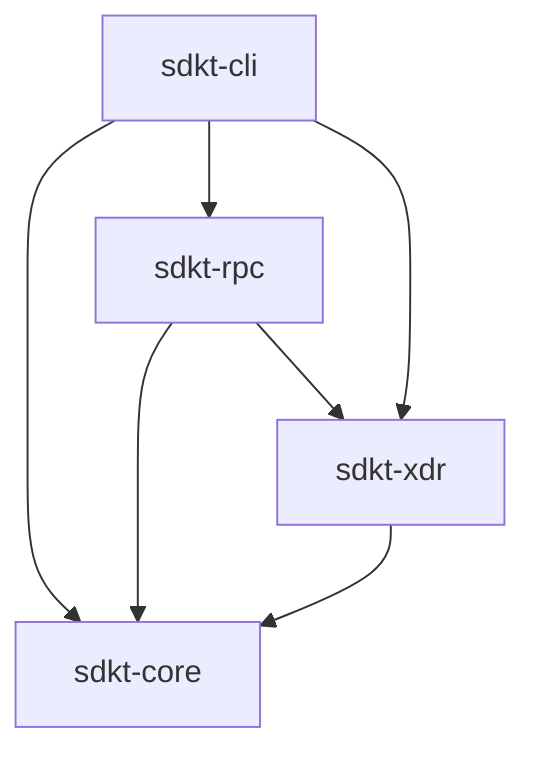

# sdkt Workspace Architecture

## Overview
Soroban DevKit (`sdkt`) is a modular Rust workspace providing a unified toolkit for Stellar and Soroban development. It is split into specialized crates to ensure fast compile times, clean dependency boundaries, and easy extensibility.

## Crate Layout and Dependency Flow

### 1. `sdkt-core`
- **Purpose**: Global configuration and shared types.
- **Key Structs**: `DevKitConfig`, `NetworkConfig`, `DecodeConfig`, `StorageConfig`, `OutputFormat`.
- **Dependencies**: `serde`, `toml`.
- **Rule**: Must not depend on any other workspace crate.

### 2. `sdkt-xdr`
- **Purpose**: XDR decoding, encoding, and raw payload manipulation.
- **Key Functions**: `decode()`, `encode_ledger_key()`, `extract_wasm_hash()`.
- **Dependencies**: `stellar-xdr`, `base64`, `hex`, `sdkt-core`.
- **Rule**: Must not perform networking or I/O.

### 3. `sdkt-rpc`
- **Purpose**: Communication with Soroban RPC nodes and aggregation of on-chain data.
- **Key Structs**: `SorobanRpcClient`, `TtlInfo`, `ContractInspection`.
- **Dependencies**: `reqwest`, `tokio`, `sdkt-core`, `sdkt-xdr`.
- **Rule**: Must abstract raw JSON-RPC into strongly typed Rust structs.

### 4. `sdkt-storage` (Milestone 4 Planned)
- **Purpose**: Complex storage grouping and offline analysis.
- **Key Structs**: `StorageAnalyzer`, `StorageReport`.
- **Dependencies**: `sdkt-rpc`, `sdkt-core`.
- **Rule**: Handles complex business logic over raw RPC responses (e.g. categorizing Instance vs Persistent vs Temporary storage).

### 5. `sdkt-cli`
- **Purpose**: User-facing command line interface.
- **Key Structs**: `Cli`, `Commands`.
- **Dependencies**: `clap`, `tokio`, `sdkt-core`, `sdkt-rpc`, `sdkt-xdr`.
- **Rule**: Must not contain heavy business logic; it routes commands to the appropriate crate and handles formatting/output.

## RPC Interaction Flow

1. **CLI Routing**: `sdkt-cli` parses arguments and loads `.sdkt.toml` via `sdkt-core`.
2. **Client Init**: `SorobanRpcClient::from_config(&config.network)` is initialized.
3. **RPC Execution**: `sdkt-cli` calls a high-level function like `sdkt_rpc::inspect_contract()`.
4. **Encoding**: `sdkt-rpc` uses `sdkt-xdr` to encode the necessary `LedgerKey`s.
5. **Network**: `sdkt-rpc` performs the HTTP POST using `reqwest`.
6. **Decoding**: `sdkt-rpc` uses `sdkt-xdr` to parse the returned XDR payload into domain types.
7. **Output**: `sdkt-cli` matches the result and formats it using `sdkt_core::OutputFormat`.